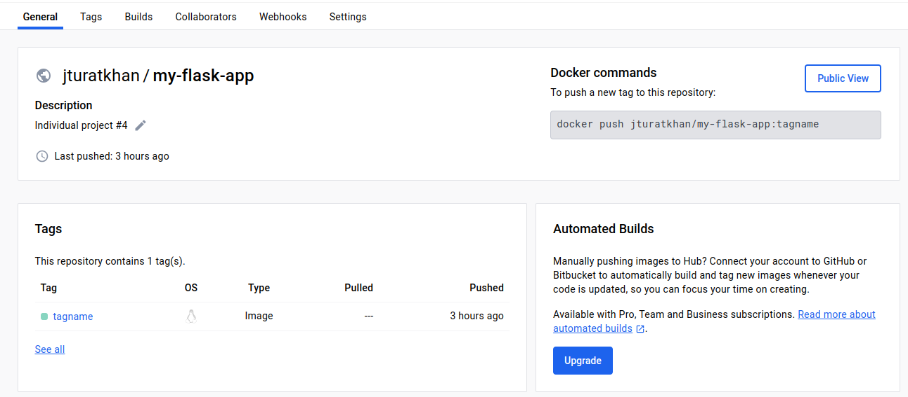
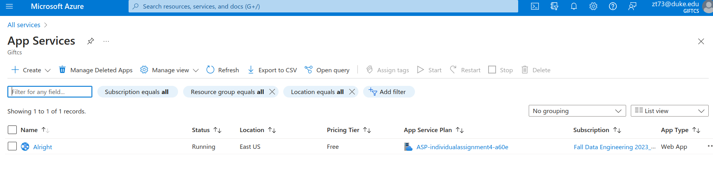

[](https://github.com/nogibjj/ZT-DE-IndividualAssnmt4/actions/workflows/docker-build.yml)
[](https://github.com/nogibjj/ZT-DE-IndividualAssnmt4/actions/workflows/main.yml)
# Auto-Scaling Flask App on Azure 🍉🍌🫐

## Project Overview

This repository contains a Flask web application designed to demonstrate the auto-scaling features of Azure App Services. The application provides a simple web page that displays a welcome message and can be scaled automatically based on demand.

## Dependencies

- Flask: A lightweight WSGI web application framework.
- gunicorn: A Python WSGI HTTP Server for UNIX.
- azure-storage-blob: Azure Blob Storage interaction library (if used).
- Other required libraries are listed in `requirements.txt`.

## How to Run the Application

### Local Setup

1. Clone the repository:
   ```sh
   'git clone https://github.com/nogibjj/ZT-DE-IndividualAssnmt4'

#### 1. Navigate to the repository directory
   ```python
   'cd ZT-DE-IndividualAssnmt4'
   ```
#### 2. Install the dependencies
   ```python
   'pip install -r requirements.txt'
   ```
#### 3. Run the application
   ```python
   'python app.py'
   ```
## RUNNING WITH DOCKER

#### 1. Build the Docker image:
   ```python
   'docker build -t my-flask-app .'
   ```
#### 2. Run the Docker container:
   ```python
   'docker run -p 5000:5000 my-flask-app'
   ```


## DEPLOYING TO AZURE
The app is containerized and deployed to Azure Web App, with auto-scaling configured to handle varying loads.


## DEMO VIDEO: https://vimeo.com/895160897/58dd8eb599?share=copy 
